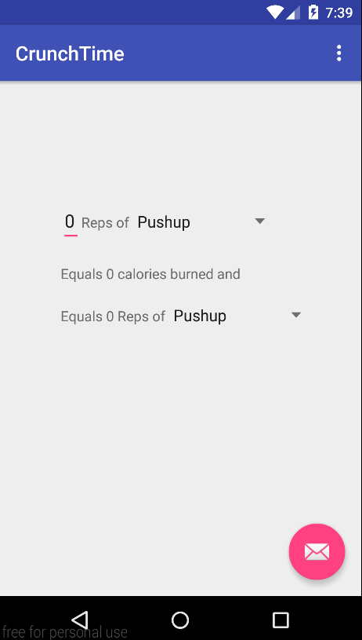
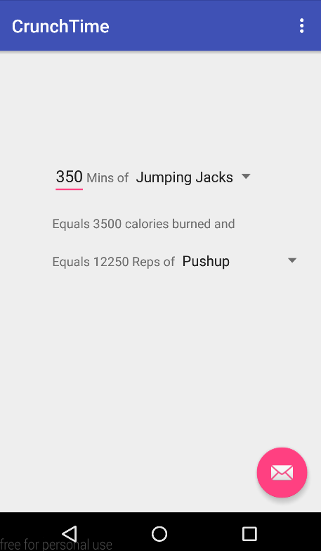
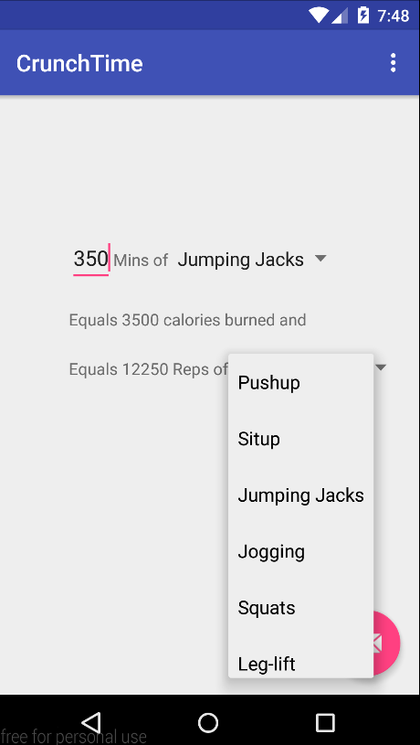
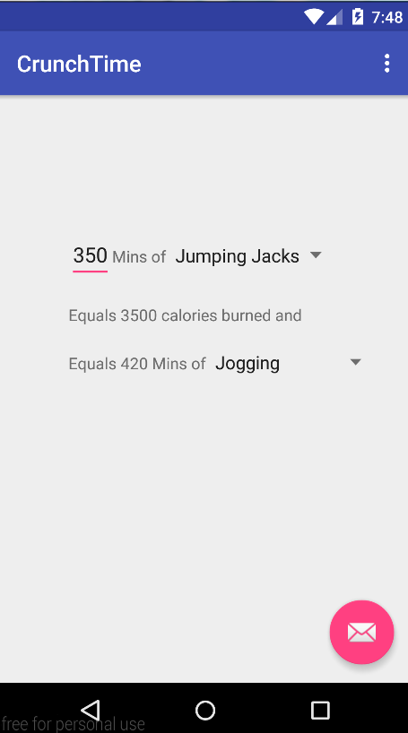

# PROG 01: Crunch Time

LittleGymBuddy is a self-explanatory, basic fitness app, that allows the user to easily find out how many calories they have burned doing a certain amount of a particular exercise. It also allows users to find out how much of any other type of exercise they would have to do to burn an equivalent amount of calories. 

## Authors

Ilakya Palanisamy ([ilakya.palanisamy@berkeley.edu](mailto:ilakya.palanisamy@berkeley.edu))

## Demo Video

See the LittleGymBuddy demo here. (https://vimeo.com/154377239)

## Screenshots

